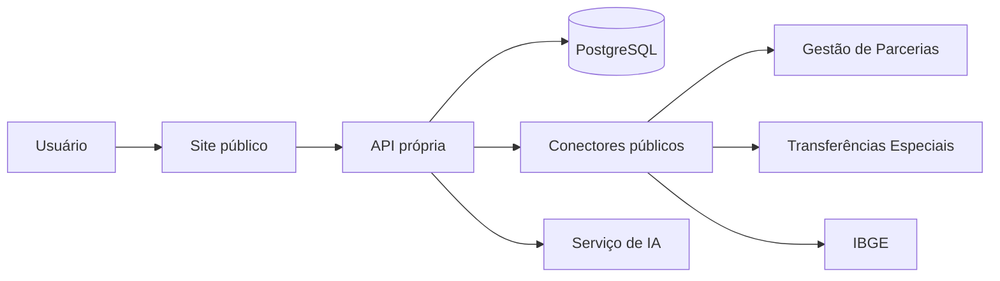

# Arquitetura

A pasta `site` é uma entrega estática segura. A pasta `frontend` contém a base da futura SPA em React. O backend centraliza integrações, cache, consultas estruturadas e proteção de credenciais.
